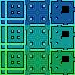

# mktileset

Tired of defining bitmasks and collision shapes for your minimal 3x3 tilesets in Godot by hand?

[mktileset](mktileset.py) can do that for you with a single command line.

## How to use

All you need is a tileset png file that follows the
[3x3 minimal template](https://docs.godotengine.org/en/stable/tutorials/2d/using_tilemaps.html#x3-minimal)
proposed on the official Godot documentation, **placed on the root directory of your Godot project**.

### Simple tiles

Example: [`simple.png`](simple.png)

Now, on the terminal:

`$ python mktileset.py simple.png`

It will output the `tres` file [`simple.tres`](simple.tres) that you can use on a `TileMap` node.
You will then be able to use a tile called `autotile` which is ready for... autotiling.
The tiles have optimized collision shapes. Have fun :)

### Multiple tiles

The script also accepts tileset images that contain multiple sprites for each cell.

Example: [`multiple.png`](multiple.png)

Now, on the terminal:

`$ python mktileset.py multiple.png`

It will output the `tres` file [`multiple.tres`](multiple.tres). When you use it for autotiling, each cell
will be chosen randomly from the three possibilities on the image. Yeah, it does the math by itself and is
able to recognize three tilesets on the same file.

